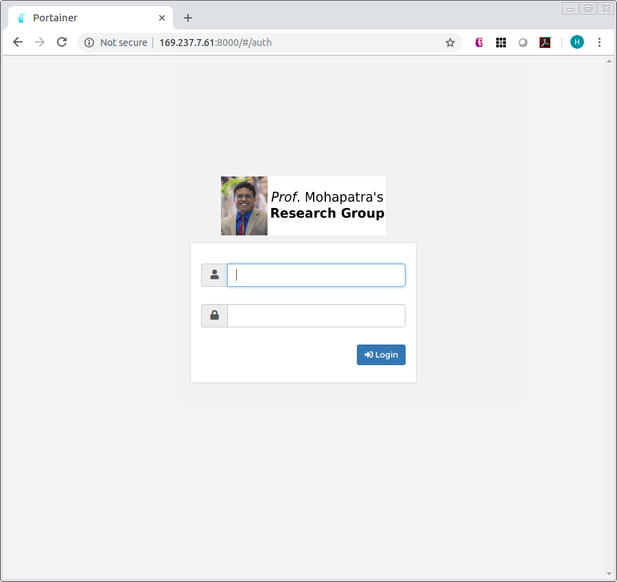
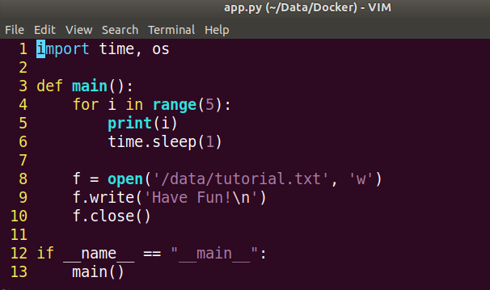
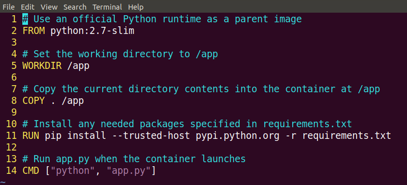
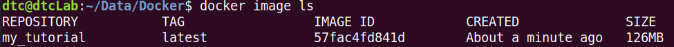
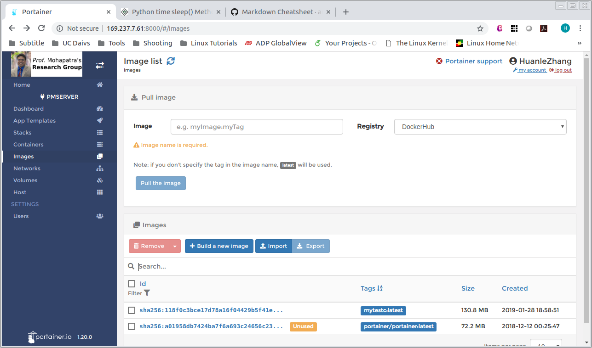
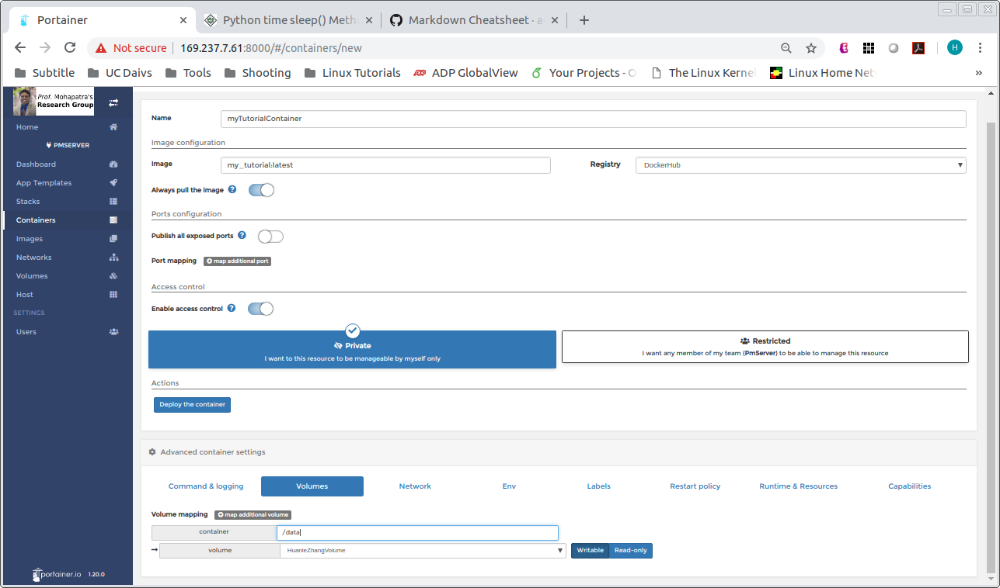
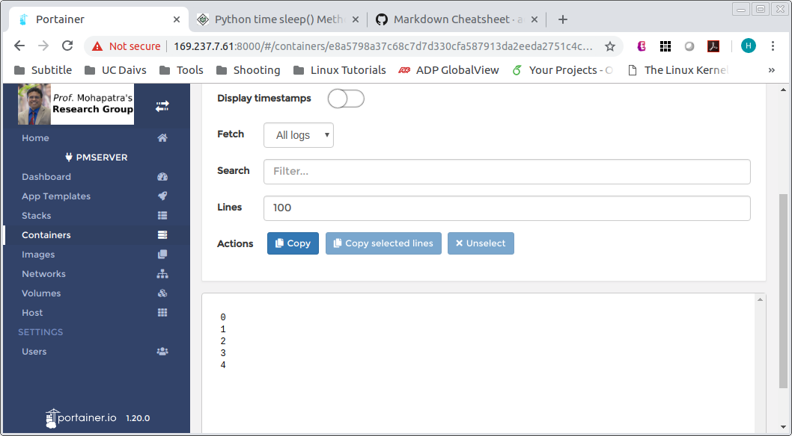
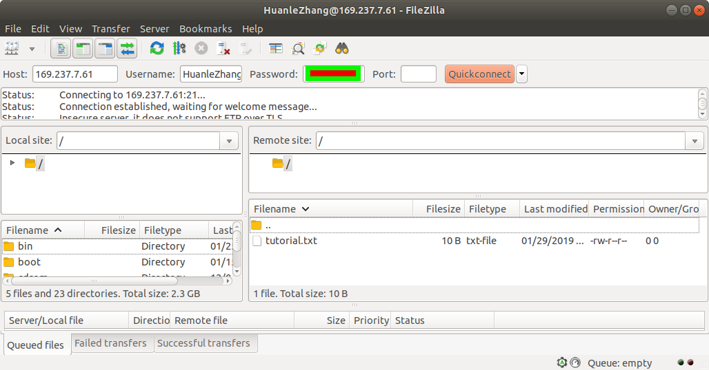

# PM-Server

**Internal Usage**

Advisor: *Prof.* [Prasant Mohapatra](https://faculty.engineering.ucdavis.edu/mohapatra/)  
Maintainer: [Huanle Zhang](https://www.huanlezhang.com)

## Access Docker Environment
* IP address: http://169.237.7.61:8000
* Username: FirstnameLastname (Change your password ASAP)
  

* One docker Volume is created for each one. Do not delete it or create new one. You're only allowed to access the folder/path of the assigned Volume.
* To access your Volume data, use FTP with username: FirstnameLastname (Come to me to change your FTP password)

### Important!

* Please remove unused docker images and containers to save space.
* Please do **NOT** use the server to store your data. We have ordered a data station and you can save your data there.

## Tutorial

This tutorial will show you how to use the server.

1. Download the tutorial folder
1. `app.py` is the program as shown below. It prints out some messages, and write a string to file named `/data/tutorial.txt`.

    
1. `requirements.txt` specifies external packages your program is dependent on. Since we only use builtin `time` and `os` packages in this tutorial, this file is empty.
1. `Dockerfile` specifies how to run your program.

    
1. Build docker image. Under this tutorial folder, run
    ```
    docker build --tag=my_tutorial .
    ```
    `--tag=` is your docker image name
1. The docker image has been installed in you host machine already. To show your docker images, run
    ```
    docker image ls
    ```
    You can see my_tutorial docker image

    
1. To save `my_tutorial` docker as an archive file so that you can upload to server. run
  ```
  docker save -o my_tutorial.tar my_tutorial
  ```
  `-o` specifies the output path/filename. `my_tutorial` is the docker name
1. Upload to server. Login in the server, under `images` tag, click `Import` button
  
1. Upload `my_tutorial.tar`
1. Go to `Containers` tag, click `Add container`, fill in Name, Image, scroll down to the Volumes tag, click map additional volume, type in `/data` (because we save a file to /data/tutorial.txt), select your volume,
  
1. Click `Deploy the container`. Your docker image is running automatically. After it finishes, it stops.
1. Click the `Logs` under `Quick actions`, you can see the output

    
1. To access `tutorial.txt`, login in using FTP client. Type in the IP address, username (FirstnameLastname), and your password. The `tutorial.txt` file is under your root directory

    
