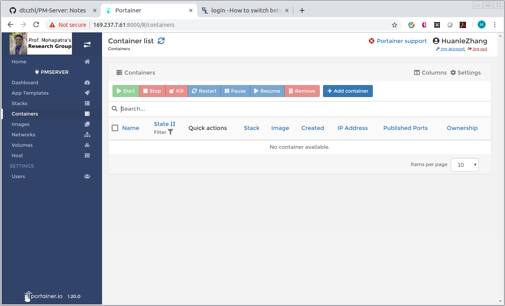
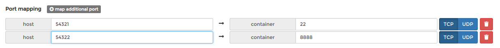

# PM-Server

Please refer to
**https://spirit.cs.ucdavis.edu/workstation**


## Internal Maintenance Version


Advisor: *Prof.* [Prasant Mohapatra](https://faculty.engineering.ucdavis.edu/mohapatra/)  

## Access Docker Environment
* IP address: http://169.237.7.61:8000
* Username: FirstnameLastname (Change your password ASAP)

    


### Important!

* Please remove unused docker images and containers to save space.
* Please do **NOT** use the server to store your data. We have a data station to save your data there.

### Port Allocation
<p id="port_allocate"> Port allocation </p>

* Huanle Zhang: 55000 - 55099
* Abhishek Roy: 55100 - 55199
* Anshuman Chhabra: 55200 - 55299
* Debraj Basu: 55300 - 55399
* Hao Fu: 55400 - 55499
* Tianbo Gu: 55500 - 55599
* Zheng Fang: 55600 - 55699
* Muchen Wu: 55700 - 55799

## Tutorial

This tutorial shows how to run Tensorflow with GPU support.

1. Add container

    
1. Type in **Name**, **Image** (tensorflow/tensorflow:1.12.0-gpu-py3), enable `Publish all exposed ports`, Port mapping 22 for ssh, 8888 for Jupyter. **For easy management, I have allocated a port range for each one <a href="port_allocate"> here </a>**. Below is an example

    
1. Under `Advanced container settings`: `Command & logging`, choose Console `Interactive & TTY (-i -t)`
1. Under `Runtime & Resources`. Choose `Runtime` to nvidia
1. Click `Deploy the container`. Your container is running now.
1. To enable SSH login into your container. Click Console of your container, and connects. Type in the following commands to install SSH

    ```
    apt-get update
    apt-get install ssh
    service ssh restart
    ```
1. You need to create non-root user for SSH

    ```
    adduser USERNAME
    ```
1. Connect to your container (you can regard it as a standalone computer)

    ```
    ssh USERNAME@IP -p Port  
    ```


## Notes

* Tensorflow 1.13 is not supported. 1.12.0 is working. Old Tensorflow versions might also not supported.
* If you encounter unexpected errors such as "not enough shared memory", contact the administrator. Once you get a normal user account of the workstation (not Portainer account) from the administrator, you can then ssh into the workstation and use docker command options (e.g. `--shm-size`) not supported by Portatiner yet. The following command provides a Tensorflow code example, you can use it check whether your environment is good.

  ```
  docker run --runtime=nvidia -it --shm-size=256m --rm tensorflow/tensorflow:1.12.0-gpu-py3    python -c "import tensorflow as tf; tf.enable_eager_execution(); print(tf.reduce_sum(tf.random_normal([1000, 1000])))"
  ```
  Just replace the content after -c of the above command to your code.

## Run Basic Programs (Not Recommended)

**Discontinued! SFTP is disabled and Volumes are deleted**

This tutorial will show you how to use the server.

1. Download the `tutorial` folder
1. `app.py` is the program as shown below. It prints out some messages, and write a string to a file named `/data/tutorial.txt`.

    
1. `requirements.txt` specifies external packages your program is dependent on. Since we only use builtin `time` and `os` packages in this tutorial, this file is empty.
1. `Dockerfile` specifies how to run your program.

    
1. Build docker image. Under this tutorial folder, run
    ```
    docker build --tag=my_tutorial .
    ```
    `--tag` is your docker image name
1. After executing the previous command, the docker image has been installed in you host machine already. To show your docker images, run
    ```
    docker image ls
    ```
    You can see `my_tutorial` docker image as shown below

    
1. To save `my_tutorial` docker as an archive file so that you can upload to the server. Run
    ```
    docker save -o my_tutorial.tar my_tutorial
    ```
    `-o` specifies the output path/filename. `my_tutorial` is the docker name
1. Upload to server. Login into the server, under `images` tag, click `Import` button

    
1. Upload `my_tutorial.tar`
1. Go to `Containers` tag, click `Add container`, fill in Name, Image, scroll down to the Volumes tag, click map additional volume, type in `/data` (because we save a file to `/data/tutorial.txt`), select your volume named FirstnameLastname (everyone is pre-allocated with one)

    
1. Click `Deploy the container`. Your docker image is running automatically. It stops after it finish running the program.
1. Click the `Logs` under `Quick actions`, you can see the output from `print()`

    
1. To access `/data/tutorial.txt`, login in using any SFTP client you like (I'm using FileZilla in Ubuntu). Type in the IP address (same as the server, but without the port number), username (FirstnameLastname), your password, and port 22. You can find the `tutorial.txt` file under your `Volume` directory
