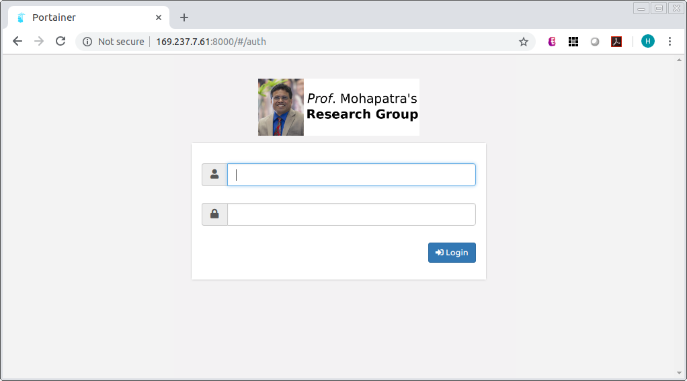

# PM-Server

**Internal Usage**

Advisor: *Prof.* [Prasant Mohapatra](https://faculty.engineering.ucdavis.edu/mohapatra/)  
Maintainer: [Huanle Zhang](https://www.huanlezhang.com)

## Access Docker Environment
* IP address: http://169.237.7.61:8000
* Username: FirstnameLastname
* Please change your password ASAP

  

* One docker Volume created for each one. Do not delete it or create new one. You're only allowed to access the folder/path of the Volume.
* To access your Volume data, use FTP with username: FirstnameLastname

## TODO: a short tutorial on how to use it.
